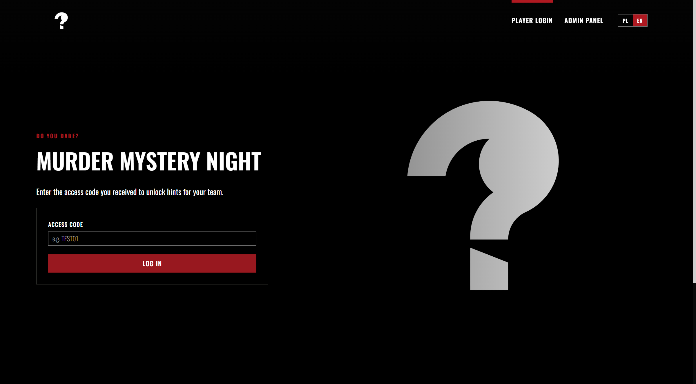

# Murder Mystery Night (MMN)

**Language:** [English](README.md) · [Polski](README.pl.md)


A web app for a live murder-mystery evening.

Players log in with a **team join code**, then take hints from characters. The whole team shares one pool of chances. An organiser (admin) creates games, characters, hints, and codes.

You do **not** need to know how to code to set this up. You will click through websites, copy-paste a few values, and type a few commands in a window called PowerShell (Windows) or Terminal (Mac).

Player login looks like this:



After logging in with a code such as `TEST01`, the investigation board looks like this:


---

## What you will end up with

1. The app running on your computer (for testing).
2. A Firebase project in the cloud (this is where games and team progress are stored).
3. Optionally, a public website you can send to players, for example `https://YOUR-PROJECT.web.app`.

A credit card is **not** required — this fits in Firebase’s free *Spark* plan.

---

## What you need before you start

Install these **once** on the computer you will use:

| Tool | Why | Where to get it |
|------|-----|-----------------|
| **Node.js LTS** | Runs the app and the install commands | [https://nodejs.org](https://nodejs.org) — the **LTS** version |
| **Git** | Downloads this project | [https://git-scm.com](https://git-scm.com) |
| **A Google account** | Needed for Firebase | Any Gmail / Google account (a company account is best) |
| **A text editor** | To edit the secret config file | Notepad is fine. [VS Code](https://code.visualstudio.com/) or Cursor is nicer |

On the Node.js site choose **Windows installer** next to the version marked **LTS** (not “Latest”):


After installing Node.js, **close and reopen** PowerShell / Terminal.

Check that it worked. On Windows, open **PowerShell** and type:

```powershell
node -v
npm -v
git --version
```

Each command should print a version number. If it says the command is not recognised, Node.js or Git is not installed (or you did not reopen the window).

---

## 1. Get the project onto your computer

### Option A — with Git (recommended)

Open PowerShell and run:

```powershell
cd $HOME\repos
git clone https://github.com/pawellogin/MMN_app.git
cd MMN_app
```

If you do not have a `repos` folder, create it first, or clone into Desktop:

```powershell
cd $HOME\Desktop
git clone https://github.com/pawellogin/MMN_app.git
cd MMN_app
```

### Option B — without Git

1. Open [https://github.com/pawellogin/MMN_app](https://github.com/pawellogin/MMN_app).
2. Click the green **Code** button.
3. Click **Download ZIP**.
4. Unzip it somewhere easy to find, for example `Desktop\MMN_app`.
5. In PowerShell:

```powershell
cd $HOME\Desktop\MMN_app
```


---

## 2. Install the app’s packages

Stay in the project folder and run:

```powershell
npm install
```

This can take a few minutes the first time. Wait until it finishes and you see the prompt again. You only need this again if someone adds new packages.

---

## 3. Create a Firebase project (the online database)

Firebase is Google’s hosting + database. The app will not work until this is done.

The app only needs:

| Service | What it is for |
|---------|----------------|
| **Firestore Database** | games, characters, hints, codes, character photos |
| **Hosting** (later) | the public URL, e.g. `https://name.web.app` |

Firebase Storage and Authentication are **not** needed.

The Firebase pictures below are an *approximate* look (Google changes the console often). Click the same button names.

### 3.1 Sign in and create the project

1. Open [https://console.firebase.google.com](https://console.firebase.google.com).
2. Sign in with Google (a company account is best):


3. Click **Create a project** (or **Add project**).


4. Name it, for example `mmn-game`. Remember the **Project ID** under the name — the site URL will be `https://<project-id>.web.app`.
5. You can turn **Google Analytics** off — it is not required.
6. Click through until the project is ready, then open it.

### 3.2 Register a Web app (this gives you the keys)

1. On the project overview, click the **</>** (Web) icon.  
   If you already have apps listed, you can open an existing **Web** app instead.


2. App nickname: anything, for example `MMN web`.
3. You can skip **Firebase Hosting** for now (we add that later if you want a public link).
4. Click **Register app**.
5. You will see a snippet that looks like this:


Keep this tab open. You will copy those six values in the next step.

These keys are not your Google password — you can email them to the person who wires up the app. **Do not post them publicly** together with open database rules.

### 3.3 Put the keys into a local file called `.env`

The app reads secrets from a file named `.env` in the project folder. That file is **not** uploaded to GitHub (on purpose).

1. In the project folder, copy the example file:

```powershell
copy .env.example .env
```

On a Mac:

```bash
cp .env.example .env
```

2. Open `.env` in Notepad / VS Code. It looks like this:

```env
VITE_FIREBASE_API_KEY=
VITE_FIREBASE_AUTH_DOMAIN=
VITE_FIREBASE_PROJECT_ID=
VITE_FIREBASE_STORAGE_BUCKET=
VITE_FIREBASE_MESSAGING_SENDER_ID=
VITE_FIREBASE_APP_ID=
VITE_ADMIN_PIN=mmn-admin
```

3. Paste each value from the Firebase snippet after the `=` — **no quotes, no spaces**.

Example (fake values):

```env
VITE_FIREBASE_API_KEY=AIzaSyExampleKeyNotReal
VITE_FIREBASE_AUTH_DOMAIN=mmn-app.firebaseapp.com
VITE_FIREBASE_PROJECT_ID=mmn-app
VITE_FIREBASE_STORAGE_BUCKET=mmn-app.firebasestorage.app
VITE_FIREBASE_MESSAGING_SENDER_ID=123456789012
VITE_FIREBASE_APP_ID=1:123456789012:web:abcdef123456
VITE_ADMIN_PIN=mmn-admin
```

4. Save the file.

`VITE_ADMIN_PIN` is the password for the organiser page (`/admin`). Change it to something only you know. After you change it, restart the app (and redeploy if the site is already online).

### 3.4 Create the Firestore database

This is the actual storage for games, characters, and team progress.

1. In Firebase Console, open the left menu → **Build → Firestore Database**.
2. Click **Create database**.


3. Edition: **Standard**.
4. Location: pick the one closest to you (for Poland, `eur3 (europe-west)` or `europe-central2` is fine). You cannot change this later easily.
5. Start in **test mode** if asked, then click Create. Wait until the database exists.

Test mode **expires after 30 days**. That is why the next step publishes lasting rules from this project — otherwise the app will stop saving data after a month.

### 3.5 Paste the security rules

The project ships with “prototype” rules: anyone who has the website can read and write data. That is what the app needs right now (there is no player login with email).

**Do this, or the admin page will show an error and nothing will save.**

1. Still in **Firestore Database**, open the **Rules** tab (this is *not* Storage).
2. Delete whatever is there and paste the contents of the file `firestore.rules` from this project:

```
rules_version = '2';
service cloud.firestore {
  match /databases/{database}/documents {
    match /{document=**} {
      allow read, write: if true;
    }
  }
}
```

3. Click **Publish**. Wait a few seconds.


> These open rules are fine for a private event with friends. Do not advertise the site publicly without tightening the rules first.

### 3.6 (Optional) Invite a developer

If someone else should finish the setup:

1. **Project settings → Users and permissions**.
2. **Add member** — their Google email.
3. Role: **Owner** or **Editor**.

The project still belongs to the account owner. You can remove access later.

---

## 4. Run the app on your computer

In the project folder:

```powershell
npm run dev
```

It will print a local address, usually:

```
http://localhost:5173
```

Open that in Chrome or Edge.

- If you see a yellow warning about Firebase, the `.env` file is empty or the app was not restarted after you saved it. Stop the server with `Ctrl+C`, then run `npm run dev` again.
- Leave this window open while you use the app. Closing it stops the local site.

---

## 5. First login (admin + a test game)

### Open the admin panel

1. In the app, click **Admin panel** (or go to `http://localhost:5173/admin`).
2. Enter the PIN from `.env` (`mmn-admin` unless you changed it).


### Load the sample game (optional, fastest way to try)

On the Games page, click **Load test game**.


That creates:

- a game named **Test game**
- 8 sample characters with 3 hints each
- join code **`TEST01`**
- 12 team chances

Then:

1. Go back to the login page (`/`).
2. Type `TEST01` and log in.
3. Click a character → **Take hint**. The whole team shares the remaining chances.

Loading the test game again **overwrites** that test game (code `TEST01`), not other games you created yourself.

### Create your real game instead

On **Games** click **New game**, then fill in:

| Field | Meaning |
|--------|---------|
| Game name | Shown to you in admin (English + Polish) |
| Team chance limit | How many hint-attempts the whole team has |
| Hint roulette | If on, every hint is a red/black bet: win = see the hint, lose = chance is spent and nothing is revealed |
| Hint order | **Sequential** = hints come in the order you typed them. **Random** = a leftover hint is picked at random |
| Characters | Name, optional photo (square crop), and the hint texts (EN + PL) |

Top of the editor (name, limit, join code):


One character with hints:


Click **Save game**. The first join code is created automatically. You can add more codes (one per team) with **Add code**.

Give each team their code. Everyone with the same code sees the same unlocked hints and the same remaining chances.

### Useful admin actions per code

- **Copy code** — put it on a slip of paper / message.
- **Reset code** — clears that team’s progress so they can play again.
- **Delete code** — removes the team login.
- Open **Taken hints** to see what they already unlocked.

---

## 6. What a non-technical person can change

There are two kinds of changes: **in the admin website** (no files) and **in a few project files**.

### Change the game itself — use Admin (no coding)

Do this in `/admin` after you are logged in:

- Add / rename characters
- Add / edit / remove hints (English and Polish)
- Upload a character photo (it is cropped to a square)
- Change how many chances a team has
- Turn roulette on or off
- Switch hint order (in order vs random)
- Create extra team codes
- Reset a team before a new evening

This is the main way to prepare a real event.

### Change the look and the words — edit files

Restart `npm run dev` after these (stop with `Ctrl+C`, start again). If the site is already deployed, you must deploy again for players to see the change.

| What you want | File | What to do |
|---------------|------|------------|
| Browser tab title | `index.html` | Change the text inside `<title>...</title>` |
| Logo in the header | `public/brand/logo.webp` | Replace the file, keep the same name |
| Big background on the login page | `public/brand/hero.webp` | Replace the file, keep the same name |
| Favicon (tiny icon in the tab) | `public/brand/favicon.webp` | Replace the file, keep the same name |
| Main red colour | `src/styles/theme.ts` | Change `primary: '#af1921'` to another hex colour. Also change `theme-color` in `index.html` to match |
| App name and almost all on-screen text | `src/i18n/translations.ts` | There is an `en: { ... }` block and a `pl: { ... }` block. Change the quoted sentences. Leave the names on the left (`appName:`, `logIn:`, …) alone |
| Admin PIN | `.env` | Change `VITE_ADMIN_PIN=...` |
| Sample demo characters (only if you use **Load test game**) | `src/data/demoContent.ts` | Names, hint sentences, chance limit |

Tips:

- Keep image names exactly as above (`logo.webp`, `hero.webp`, `favicon.webp`) or the site will look for files that no longer exist.
- Prefer `.webp` or `.png`. The logo is shown large in the header; a transparent background works well.
- In `translations.ts`, if a line looks like `` takeHintConfirmTitle: (name) => `Take a hint from ${name}?` ``, you can change the words but keep `${name}` — that is where the character name is inserted.

You do **not** need to edit Firestore by hand. Prefer the admin screens.

---

## 7. How the game works (so you know what to configure)

| Idea | What it means |
|------|----------------|
| Join code | Shared password for one team, e.g. `TEST01` or `K7Q2LM` |
| Team chances | One number for the whole team (e.g. 16). Every “take hint” (or lost roulette spin) uses 1 |
| Character | A person on the board, with their own list of hints and a photo |
| Sequential hints | First take → hint 1, second take → hint 2, and so on |
| Random hints | Each take picks one unused hint on that character |
| Roulette (optional) | Bet red or black. Correct → hint is shown. Wrong → chance gone, no hint |
| Languages | The EN / PL switch in the header. Hint and game texts should be filled in both languages |

If a character is empty, players cannot take more from them. If the team is at 16/16 (or whatever limit you set), nobody can take more hints.

---

## 8. Pages in the app

| Address | Who uses it |
|---------|-------------|
| `/` | Players — enter the join code |
| `/play` | Players — characters, take hints, list of unlocked hints |
| `/admin` | You — PIN |
| `/admin/games` | You — list of games, load test game, new game |
| `/admin/games/...` | You — edit one game, codes, characters, hints |

---

## 9. Put it online so players do not need your computer

This uses **Firebase Hosting**. Players open a normal https link on their phones.

You only need to do the login / project-link steps once per computer.

```powershell
cd path\to\MMN_app
npx firebase login
npx firebase use --add
npm run deploy
```

What those commands do:

1. **`firebase login`** — a browser window opens. Sign in with the **same Google account** that owns the Firebase project.
2. **`firebase use --add`** — pick your project from the list, then type an alias, for example `default`.
3. **`npm run deploy`** — builds the website and uploads it. At the end it prints a URL like:

```
https://YOUR-PROJECT-ID.web.app
```

That is the link you send to players.

Also turn on Hosting in Firebase if you skipped it earlier: **Build → Hosting → Get started**, then deploy as above.

Important:

- Vite **bakes `.env` into the build**. If you change keys or the admin PIN, run `npm run deploy` again.
- Keep `.env` on your computer only. Never send it in chat or commit it to GitHub.
- The public site uses the same open Firestore rules. Anyone with the URL can change data. Fine for a friends’ event; do not post it on social media as a public product.

**Data does not move** from an old Firebase project. A new project starts empty — create games (or load the test game) again. Players need the new link.

**Custom domain (optional):** in the console, **Hosting → Add custom domain**, for example `gra.murdermysterynight.pl` (you must add DNS records at your domain provider).

### Update the live site after you change something

```powershell
npm run deploy
```

Game content you edit in **Admin** is already in the cloud — you do **not** need to redeploy for new characters or hints. Redeploy only for look-and-feel, texts in `translations.ts`, or a new admin PIN.

---

## 10. Later: get the latest code

If the project was updated on GitHub and you originally used Git:

```powershell
cd path\to\MMN_app
git pull
npm install
```

Then start it again with `npm run dev`, or deploy again with `npm run deploy`.

Your `.env` file stays on your machine and is not overwritten.

---

## 11. If something goes wrong

| What you see | Likely cause | What to do |
|--------------|--------------|------------|
| Yellow warning “Firebase is not configured” | Empty or missing `.env`, or you did not restart | Fill `.env` from the Firebase web-app config, save, stop the server (`Ctrl+C`), run `npm run dev` again |
| Admin games list error / “permission denied” | Firestore rules were not published | Firebase → **Firestore Database → Rules** → paste `firestore.rules` → **Publish** |
| Login does nothing / “code not found” | No game or demo loaded, or typo in the code | Admin → **Load test game**, or create a game and copy the code exactly |
| `npm` is not recognised | Node.js not installed, or old terminal | Install Node.js LTS, close PowerShell, open a new one |
| `git` is not recognised | Git not installed | Install Git, open a new PowerShell |
| Changes to `.env` or colours do not appear | Dev server still running the old files | `Ctrl+C`, then `npm run dev` again. On the live site: `npm run deploy` |
| Photo upload fails / “too large” | Image is huge | Use a smaller picture (phone photos are often fine after the built-in crop) |
| Forgot the admin PIN | It lives only in `.env` | Open `.env`, read or change `VITE_ADMIN_PIN`, restart / redeploy |

---

## 12. Cost and security (short)

- **Spark** (free): about 1 GB in Firestore, 50 000 reads and 20 000 writes per day, 10 GB hosting transfer per month. Plenty for a few dozen players.
- Prototype rules are open. Tighten them before a large public launch.
- Character photos live on the Firestore document, not in Storage.

---

## 13. For someone a bit more technical

- Stack: Vite, React, TypeScript, Ant Design, Emotion, Firebase Firestore.
- Env vars are listed in `.env.example`.
- Hosting config is `firebase.json` (SPA rewrite to `index.html`).
- `npm run deploy` builds and deploys **Hosting only**. Firestore rules are applied from the Console (or `npx firebase deploy --only firestore:rules` if you prefer).
- Images are stored on the character document as a data URL. Firebase Storage is unused.
- Prototype rules allow all reads and writes. Tighten before a public launch.
