# Murder Mystery Night (MMN)

**Język:** [Polski](README.pl.md) · [English](README.md)


Aplikacja na żywe wieczory morderstwa.

Gracze logują się **kodem drużyny**, a potem biorą wskazówki od postaci. Cała drużyna ma wspólną pulę szans. Organizator (admin) tworzy gry, postacie, wskazówki i kody.

**Nie musisz umieć programować.** Klikasz w stronach internetowych, kopiujesz kilka wartości i wpisujesz kilka poleceń w oknie o nazwie PowerShell (Windows) albo Terminal (Mac).

Tak wygląda logowanie gracza:

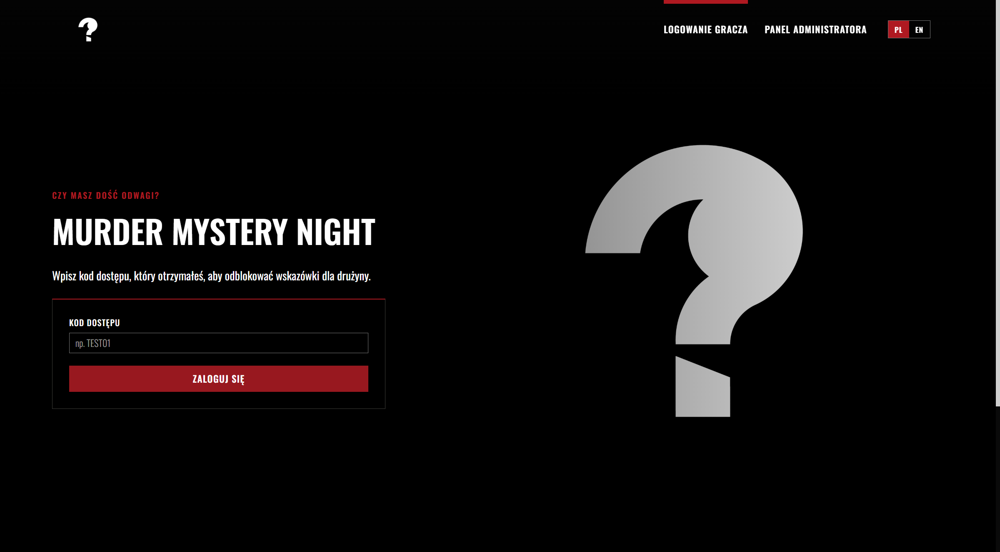

A tak — plansza ze wskazówkami po zalogowaniu kodem `TEST01`:

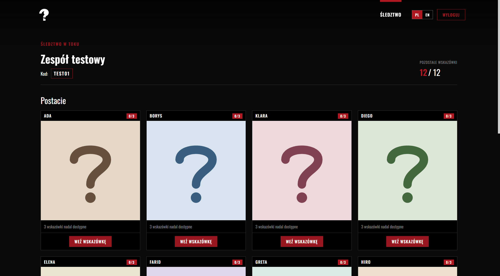

---

## Co będzie na końcu

1. Aplikacja uruchomiona na Twoim komputerze (do testów).
2. Projekt Firebase w chmurze (tu leżą gry i postępy drużyn).
3. Opcjonalnie publiczna strona, którą wyślesz graczom, np. `https://TWOJ-PROJEKT.web.app`.

Karta płatnicza **nie jest potrzebna** — to mieści się w darmowym planie Firebase *Spark*.

---

## Co zainstalować przed startem

Zrób to **raz** na komputerze, z którego będziesz pracować:

| Narzędzie | Po co | Skąd pobrać |
|-----------|--------|-------------|
| **Node.js LTS** | Uruchamia aplikację i polecenia instalacji | [https://nodejs.org](https://nodejs.org) — wersja **LTS** |
| **Git** | Pobiera ten projekt | [https://git-scm.com](https://git-scm.com) |
| **Konto Google** | Potrzebne do Firebase | Dowolne Gmail / konto Google (najlepiej firmowe) |
| **Edytor tekstu** | Do pliku z kluczami | Wystarczy Notatnik. Łatwiej w [VS Code](https://code.visualstudio.com/) albo Cursorze |

Na stronie Node.js wybierz **Windows installer** przy wersji oznaczonej **LTS** (nie „Latest”):

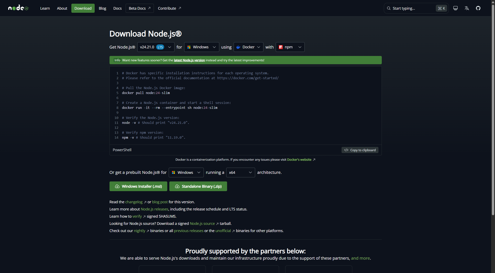

Po instalacji Node.js **zamknij i otwórz ponownie** PowerShell / Terminal.

Sprawdź, czy działa. W PowerShell wpisz:

```powershell
node -v
npm -v
git --version
```

Każde polecenie powinno wypisać numer wersji. Jeśli pisze, że polecenie jest nierozpoznane — Node.js albo Git nie jest zainstalowany (albo nie otworzyłeś nowego okna).

---

## 1. Pobierz projekt na komputer

### Wariant A — przez Git (zalecane)

Otwórz PowerShell i wpisz:

```powershell
cd $HOME\repos
git clone https://github.com/pawellogin/MMN_app.git
cd MMN_app
```

Jeśli nie masz folderu `repos`, najpierw go utwórz albo sklonuj na Pulpit:

```powershell
cd $HOME\Desktop
git clone https://github.com/pawellogin/MMN_app.git
cd MMN_app
```

### Wariant B — bez Gita (pobranie ZIP)

1. Otwórz [https://github.com/pawellogin/MMN_app](https://github.com/pawellogin/MMN_app).
2. Kliknij zielony przycisk **Code**.
3. Kliknij **Download ZIP**.
4. Rozpakuj w łatwym miejscu, np. `Pulpit\MMN_app`.
5. W PowerShell:

```powershell
cd $HOME\Desktop\MMN_app
```

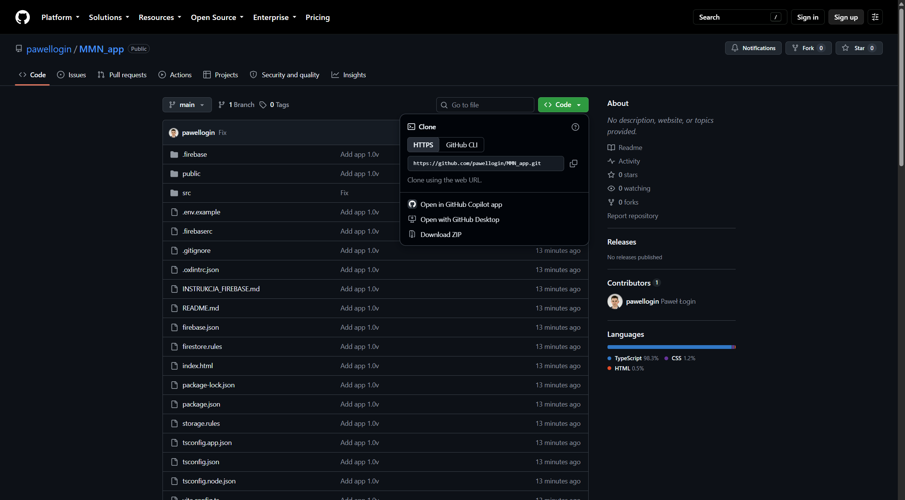

---

## 2. Zainstaluj paczki aplikacji

Zostań w folderze projektu i wpisz:

```powershell
npm install
```

Za pierwszym razem może to potrwać kilka minut. Czekaj, aż wróci znak zachęty. Powtórz tylko wtedy, gdy ktoś doda nowe paczki.

---

## 3. Załóż projekt Firebase (baza w chmurze)

Firebase to baza danych i hosting od Google. Bez tego aplikacja nie zadziała.

Aplikacja używa tylko:

| Usługa | Do czego |
|--------|----------|
| **Firestore Database** | gry, postacie, wskazówki, kody, zdjęcia postaci |
| **Hosting** (później) | publiczny adres, np. `https://nazwa.web.app` |

Firebase Storage i Authentication **nie są potrzebne**.

Zdjęcia poniżej pokazują *przybliżony* wygląd konsoli (Google często zmienia interfejs). Klikaj te same nazwy przycisków.

### 3.1 Zaloguj się i utwórz projekt

1. Otwórz [https://console.firebase.google.com](https://console.firebase.google.com).
2. Zaloguj się kontem Google (najlepiej firmowym):

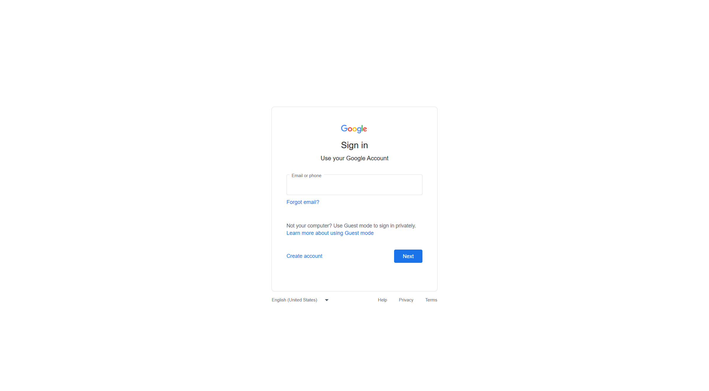

3. Kliknij **Utwórz projekt** / **Create a project** (albo **Add project**).

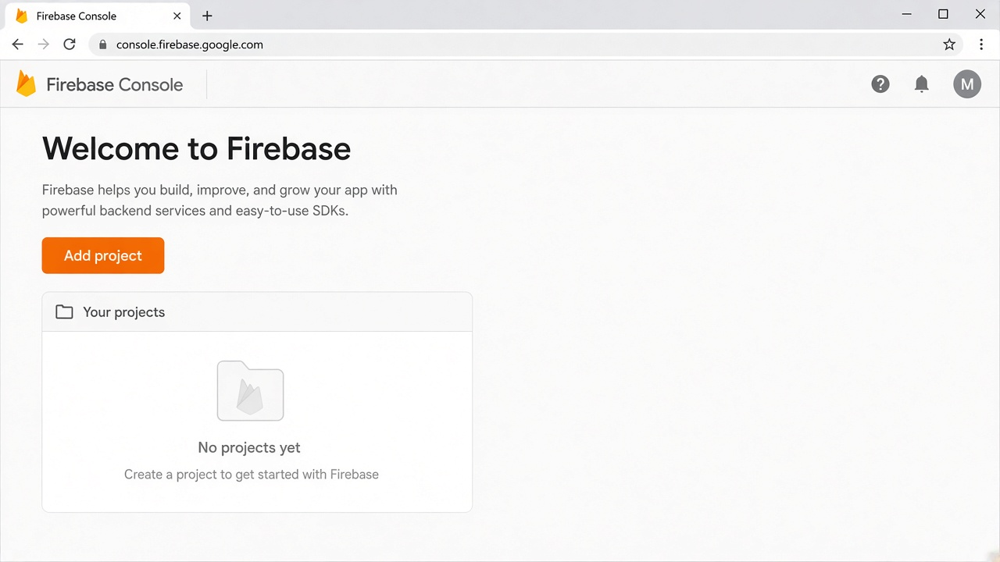

4. Nazwa, np. `mmn-game`. Zapamiętaj **identyfikator projektu** (*Project ID*) pod nazwą — od niego zależy adres strony (`https://<project-id>.web.app`).
5. Google Analytics możesz **wyłączyć**.
6. Klikaj dalej, aż projekt będzie gotowy, i wejdź do niego.

### 3.2 Zarejestruj aplikację Web (to da Ci klucze)

1. Na przeglądzie projektu kliknij ikonę **</>** (Web).  
   Jeśli aplikacje już są na liście, możesz otworzyć istniejącą **Web**.

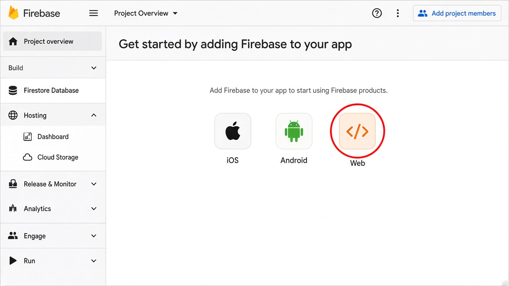

2. Nazwa: cokolwiek, np. `MMN web`.
3. Hosting możesz na razie pominąć.
4. Kliknij **Zarejestruj aplikację** / **Register app**.
5. Zobaczysz fragment kodu z obiektem `firebaseConfig`:

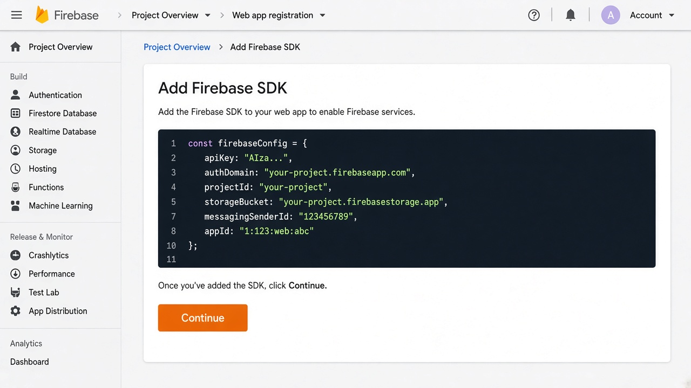

Zostaw tę kartę otwartą. Sześć wartości wkleisz w następnym kroku.

Te klucze nie są hasłem do konta Google — można je wysłać mailem do osoby, która podłącza aplikację. **Nie wrzucaj ich jednak publicznie na Facebooka** razem z otwartymi regułami bazy.

### 3.3 Wklej klucze do pliku `.env`

Aplikacja czyta klucze z pliku `.env` w folderze projektu. Ten plik **nie idzie na GitHub** (tak ma być).

1. W folderze projektu skopiuj wzór:

```powershell
copy .env.example .env
```

Na Macu:

```bash
cp .env.example .env
```

2. Otwórz `.env` w Notatniku / VS Code. Wygląda tak:

```env
VITE_FIREBASE_API_KEY=
VITE_FIREBASE_AUTH_DOMAIN=
VITE_FIREBASE_PROJECT_ID=
VITE_FIREBASE_STORAGE_BUCKET=
VITE_FIREBASE_MESSAGING_SENDER_ID=
VITE_FIREBASE_APP_ID=
VITE_ADMIN_PIN=mmn-admin
```

3. Wklej każdą wartość z `firebaseConfig` za znakiem `=` — **bez cudzysłowów i bez spacji**.

Przykład (sztuczne wartości):

```env
VITE_FIREBASE_API_KEY=AIzaSyExampleKeyNotReal
VITE_FIREBASE_AUTH_DOMAIN=mmn-app.firebaseapp.com
VITE_FIREBASE_PROJECT_ID=mmn-app
VITE_FIREBASE_STORAGE_BUCKET=mmn-app.firebasestorage.app
VITE_FIREBASE_MESSAGING_SENDER_ID=123456789012
VITE_FIREBASE_APP_ID=1:123456789012:web:abcdef123456
VITE_ADMIN_PIN=mmn-admin
```

4. Zapisz plik.

`VITE_ADMIN_PIN` to hasło do panelu organizatora (`/admin`). Zmień je na swoje. Po zmianie uruchom aplikację ponownie (i opublikuj stronę, jeśli już jest w internecie).

### 3.4 Utwórz bazę Firestore

To jest miejsce na gry, postacie i postępy drużyn.

1. W menu po lewej: **Kompilacja / Build → Firestore Database**.
2. Kliknij **Utwórz bazę danych** / **Create database**.

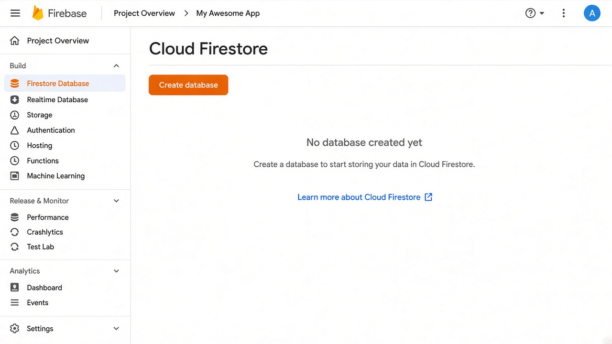

3. Wersja: **Standard**.
4. Lokalizacja: najbliższa, np. `eur3 (europe-west)` albo `europe-central2 (Warszawa)`. Później prawie się tego nie zmienia.
5. Tryb: **Rozpocznij w trybie testowym** / **Start in test mode** → **Utwórz**. Poczekaj, aż baza powstanie.

Tryb testowy **wygasa po 30 dniach**. Dlatego w następnym kroku wklej trwałe reguły z projektu — inaczej po miesiącu aplikacja przestanie zapisywać dane.

### 3.5 Wklej reguły bezpieczeństwa

W projekcie są „prototypowe” reguły: każdy, kto ma adres strony, może czytać i zapisywać dane. Tego teraz potrzebuje aplikacja (gracze nie logują się mailem).

**Zrób to, bo inaczej panel admina pokaże błąd i nic się nie zapisze.**

1. Nadal w **Firestore Database** otwórz zakładkę **Reguły / Rules** (to *nie* jest Storage).
2. Skasuj to, co tam jest, i wklej zawartość pliku `firestore.rules`:

```
rules_version = '2';
service cloud.firestore {
  match /databases/{database}/documents {
    match /{document=**} {
      allow read, write: if true;
    }
  }
}
```

3. Kliknij **Opublikuj / Publish**. Poczekaj kilka sekund.

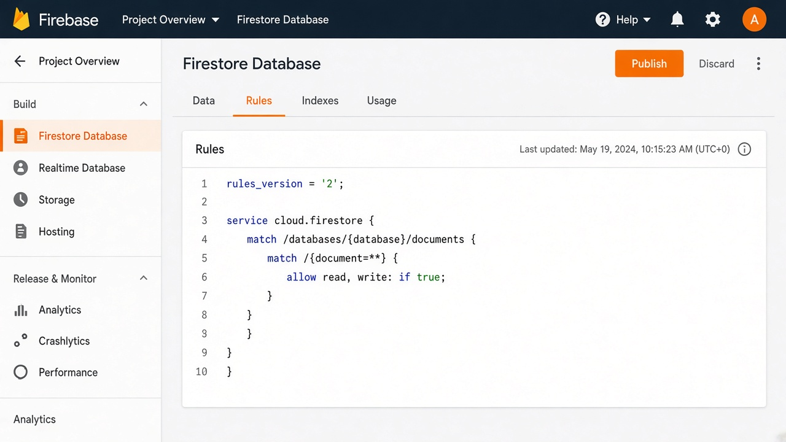

> Otwarte reguły wystarczą na prywatny event ze znajomymi. Nie reklamuj strony publicznie, zanim ich nie zaostrzysz.

### 3.6 (Opcja) Daj dostęp programiście

Jeśli resztę ma zrobić ktoś inny:

1. **Ustawienia projektu → Użytkownicy i uprawnienia**.
2. **Dodaj członka** — e-mail Google tej osoby.
3. Rola: **Właściciel** albo **Edytujący**.

Projekt nadal należy do właściciela konta. Dostęp można w każdej chwili zabrać.

---

## 4. Uruchom aplikację na komputerze

W folderze projektu:

```powershell
npm run dev
```

Pojawi się lokalny adres, zwykle:

```
http://localhost:5173
```

Otwórz go w Chrome albo Edge.

- Żółty komunikat o Firebase = pusty `.env` albo nie uruchomiłeś serwera ponownie po zapisie. Zatrzymaj serwer `Ctrl+C` i znów `npm run dev`.
- Zostaw to okno otwarte. Zamknięcie gasi lokalną stronę.

---

## 5. Pierwsze logowanie (admin + gra testowa)

### Wejdź do panelu administratora

1. W aplikacji kliknij **Panel administratora** (albo wejdź na `http://localhost:5173/admin`).
2. Wpisz PIN z pliku `.env` (`mmn-admin`, jeśli go nie zmieniałeś).


### Wczytaj grę testową (najszybszy sposób na próbę)

Na liście gier kliknij **Wczytaj grę testową**.

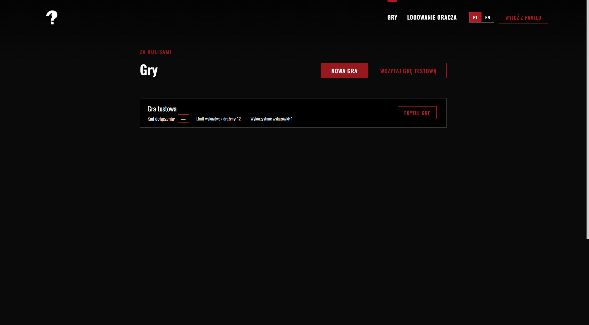

To tworzy:

- grę **Gra testowa**
- 8 przykładowych postaci po 3 wskazówki
- kod **`TEST01`**
- 12 szans drużyny

Potem:

1. Wróć na logowanie gracza (`/`).
2. Wpisz `TEST01` i zaloguj się.
3. Kliknij postać → **Weź wskazówkę**. Cała drużyna dzieli pozostałe szanse.

Ponowne wczytanie gry testowej **nadpisuje** tylko tę grę (`TEST01`), nie Twoje własne gry.

### Albo stwórz prawdziwą grę

Na liście **Gry** kliknij **Nowa gra**, potem uzupełnij:

| Pole | Znaczenie |
|------|-----------|
| Nazwa gry | Widoczna w adminie (angielski + polski) |
| Limit szans drużyny | Ile prób wskazówki ma cała drużyna |
| Ruletka | Jeśli włączona: czerwone/czarne. Wygrana = wskazówka, przegrana = szansa spalona i nic nie widać |
| Kolejność wskazówek | **W kolejności wpisania** albo **Losowo** |
| Postacie | Imię, opcjonalne zdjęcie (kadr kwadratowy) i teksty wskazówek (EN + PL) |

Góra edytora (nazwa, limit, kod):

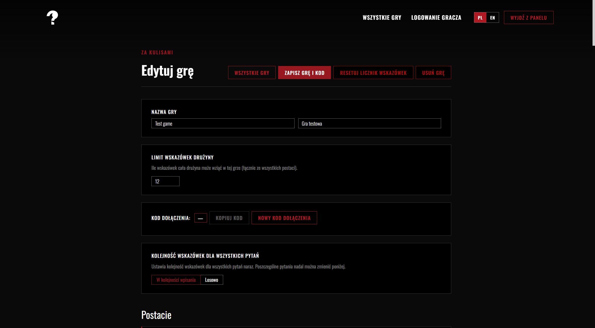

Jedna postać ze wskazówkami:

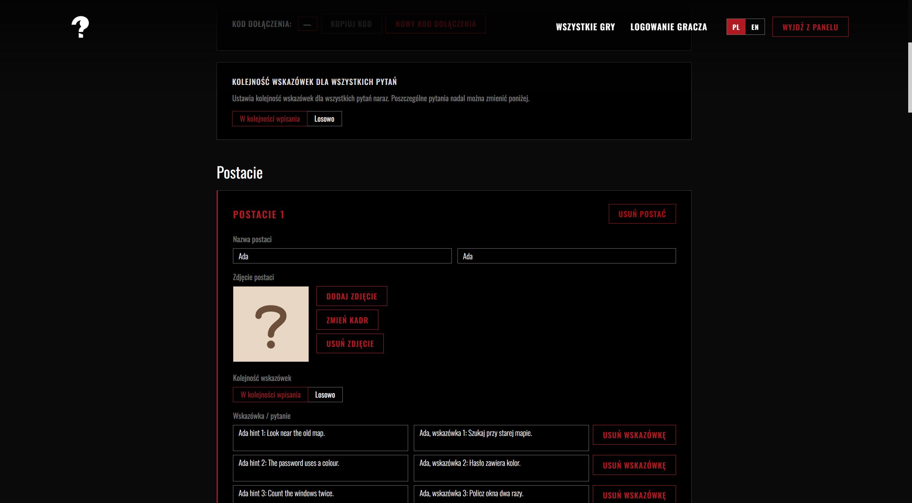

Kliknij **Zapisz grę**. Pierwszy kod dołączenia powstaje automatycznie. Kolejne kody (po jednym na drużynę) dodajesz przyciskiem **Dodaj kod** / **Nowy kod dołączenia**.

Daj każdej drużynie jej kod. Osoby z tym samym kodem widzą te same odblokowane wskazówki i ten sam licznik szans.

### Przydatne akcje przy kodzie

- **Kopiuj kod** — na karteczkę / na messengera.
- **Resetuj kod** — czyści postęp tej drużyny przed kolejnym wieczorem.
- **Usuń kod** — kasuje logowanie drużyny.
- **Wzięte wskazówki** — podgląd tego, co już odblokowali.

---

## 6. Co może zmienić osoba nietechniczna

Są dwa rodzaje zmian: **w panelu admina** (bez plików) i **w kilku plikach projektu**.

### Treść gry — tylko Admin (bez kodowania)

Po zalogowaniu na `/admin`:

- dodawaj / zmieniaj nazwy postaci
- dodawaj / edytuj / usuwaj wskazówki (angielski i polski)
- wgraj zdjęcie postaci (przycina się do kwadratu)
- zmień liczbę szans drużyny
- włącz lub wyłącz ruletkę
- ustaw kolejność wskazówek
- twórz dodatkowe kody drużyn
- resetuj drużynę przed nowym wieczorem

To jest główny sposób przygotowania prawdziwego eventu.

### Wygląd i napisy — edycja plików

Po tych zmianach uruchom `npm run dev` ponownie (`Ctrl+C`, potem znowu start). Jeśli strona jest już w internecie, musisz ją opublikować jeszcze raz.

| Co chcesz | Plik | Co zrobić |
|-----------|------|-----------|
| Tytuł w karcie przeglądarki | `index.html` | Zmień tekst w `<title>...</title>` |
| Logo w nagłówku | `public/brand/logo.webp` | Podmień plik, **zostaw tę samą nazwę** |
| Duże tło na logowaniu | `public/brand/hero.webp` | Podmień plik, zostaw tę samą nazwę |
| Ikonka w karcie (favicon) | `public/brand/favicon.webp` | Podmień plik, zostaw tę samą nazwę |
| Główny czerwony kolor | `src/styles/theme.ts` | Zmień `primary: '#af1921'` na inny kolor hex. To samo w `theme-color` w `index.html` |
| Nazwa aplikacji i prawie wszystkie napisy | `src/i18n/translations.ts` | Blok `en: { ... }` i `pl: { ... }`. Zmieniaj tylko teksty w cudzysłowach. Lewych nazw (`appName:`, `logIn:`, …) nie ruszaj |
| PIN administratora | `.env` | Zmień `VITE_ADMIN_PIN=...` |
| Postacie z **Wczytaj grę testową** | `src/data/demoContent.ts` | Imiona, zdania wskazówek, limit szans |

Wskazówki:

- Nazwy plików graficznych muszą zostać dokładnie takie (`logo.webp`, `hero.webp`, `favicon.webp`).
- Najlepiej `.webp` albo `.png`. Logo jest duże w nagłówku — przezroczyste tło wygląda dobrze.
- W `translations.ts` linia w stylu `` takeHintConfirmTitle: (name) => `Wziąć wskazówkę od ${name}?` `` — możesz zmienić słowa, ale zostaw `${name}` (tam wstawia się imię postaci).

Bazy Firestore ręcznie nie edytuj. Używaj panelu admina.

---

## 7. Jak działa gra (żeby wiedzieć, co ustawić)

| Pojęcie | Znaczenie |
|---------|-----------|
| Kod dołączenia | Wspólne hasło drużyny, np. `TEST01` |
| Szanse drużyny | Jedna liczba dla wszystkich (np. 16). Każde „weź wskazówkę” (albo przegrana ruletka) zużywa 1 |
| Postać | Osoba na planszy, ze swoją listą wskazówek i zdjęciem |
| W kolejności | Pierwsze wzięcie → wskazówka 1, drugie → 2 itd. |
| Losowo | Każde wzięcie losuje jedną niewykorzystaną wskazówkę tej postaci |
| Ruletka (opcja) | Czerwone albo czarne. Trafienie = wskazówka. Pudło = szansa spalona |
| Języki | Przełącznik EN / PL w nagłówku. Wskazówki i nazwy gry wypełniaj w obu językach |

Gdy postać jest pusta, nie da się z niej wziąć więcej. Gdy drużyna jest na limicie (np. 16/16), nikt nie bierze więcej wskazówek.

---

## 8. Strony w aplikacji

| Adres | Kto z tego korzysta |
|-------|---------------------|
| `/` | Gracze — wpisują kod |
| `/play` | Gracze — postacie, branie wskazówek, lista odblokowanych |
| `/admin` | Ty — PIN |
| `/admin/games` | Ty — lista gier, gra testowa, nowa gra |
| `/admin/games/...` | Ty — edycja jednej gry, kody, postacie, wskazówki |

---

## 9. Wrzuć stronę do internetu

To jest **Firebase Hosting**. Gracze otwierają zwykły link https na telefonie.

Logowanie i podpięcie projektu robisz raz na danym komputerze.

```powershell
cd sciezka\do\MMN_app
npx firebase login
npx firebase use --add
npm run deploy
```

Co robią te polecenia:

1. **`firebase login`** — otworzy się przeglądarka. Zaloguj się **tym samym kontem Google**, które ma projekt Firebase.
2. **`firebase use --add`** — wybierz projekt z listy i wpisz alias, np. `default`.
3. **`npm run deploy`** — buduje stronę i wgrywa ją. Na końcu pojawi się adres:

```
https://TWOJ-PROJECT-ID.web.app
```

Ten link dajesz graczom.

Jeśli wcześniej pominąłeś Hosting: **Build → Hosting → Get started**, potem deploy jak wyżej.

Ważne:

- Vite **wpieka `.env` w build**. Po zmianie kluczy albo PIN-u zrób `npm run deploy` jeszcze raz.
- `.env` zostaw tylko na swoim komputerze. Nie wysyłaj go na czacie i nie wrzucaj na GitHub.
- Publiczna strona ma te same otwarte reguły Firestore. Kto zna adres, może zmieniać dane. Na event ze znajomymi OK — nie wrzucaj linku na cały internet jako gotowego produktu.

**Dane ze starego projektu się nie przenoszą.** Nowy Firebase ma pustą bazę — gry trzeba utworzyć (albo wczytać testową) od nowa. Gracze muszą dostać nowy link.

**Własna domena (opcja):** w konsoli **Hosting → Dodaj domenę niestandardową**, np. `gra.murdermysterynight.pl` (trzeba dodać rekordy DNS u dostawcy domeny).

### Aktualizacja już opublikowanej strony

```powershell
npm run deploy
```

Treść gry zmieniona w **Adminie** jest już w chmurze — **nie** musisz publikować ponownie po nowych postaciach czy wskazówkach. Publikuj znowu tylko po zmianie wyglądu, napisów w `translations.ts` albo PIN-u admina.

---

## 10. Później: pobierz nowszą wersję kodu

Jeśli projekt zaktualizowano na GitHubie i na początku używałeś Gita:

```powershell
cd sciezka\do\MMN_app
git pull
npm install
```

Potem znów `npm run dev` albo `npm run deploy`.

Plik `.env` zostaje u Ciebie i nie zostanie nadpisany.

---

## 11. Gdy coś nie działa

| Co widzisz | Najczęstsza przyczyna | Co zrobić |
|------------|----------------------|-----------|
| Żółty komunikat „Firebase nie jest skonfigurowane” | Pusty / brak `.env` albo nie restart | Uzupełnij `.env` z konfiguracji Web, zapisz, `Ctrl+C`, znów `npm run dev` |
| Błąd listy gier / „brak uprawnień” | Nie opublikowano reguł Firestore | Firebase → **Firestore Database → Rules** → wklej `firestore.rules` → **Publish** |
| Logowanie nic nie robi / „nie ma kodu” | Brak gry albo literówka | Admin → **Wczytaj grę testową** albo stwórz grę i skopiuj kod 1:1 |
| `npm` nierozpoznane | Brak Node.js albo stare okno | Zainstaluj Node.js LTS, zamknij PowerShell, otwórz nowy |
| `git` nierozpoznane | Brak Gita | Zainstaluj Git, otwórz nowy PowerShell |
| Zmiany w `.env` / kolorach niewidoczne | Stary serwer deweloperski | `Ctrl+C`, potem `npm run dev`. Na żywej stronie: `npm run deploy` |
| Zdjęcie się nie wgrywa / „za duże” | Ogromne zdjęcie | Wybierz mniejsze (zdjęcia z telefonu po kadrze zwykle przechodzą) |
| Zapomniałem PIN-u admina | Jest tylko w `.env` | Otwórz `.env`, odczytaj albo zmień `VITE_ADMIN_PIN`, restart / deploy |

---

## 12. Koszty i bezpieczeństwo (krótko)

- Plan **Spark** (darmowy): ok. 1 GB w Firestore, 50 000 odczytów i 20 000 zapisów dziennie, 10 GB transferu hostingu miesięcznie. Na kilkadziesiąt graczy jest duży zapas.
- Reguły prototypowe są otwarte. Przed dużym, publicznym użyciem warto je zaostrzyć.
- Zdjęcia postaci siedzą w dokumencie Firestore, nie w Storage.

---

## 13. Dla kogoś trochę bardziej technicznego

- Stos: Vite, React, TypeScript, Ant Design, Emotion, Firebase Firestore.
- Zmienne środowiskowe są w `.env.example`.
- Hosting: `firebase.json` (SPA rewrite na `index.html`).
- `npm run deploy` buduje i wgrywa **tylko Hosting**. Reguły: Konsola albo `npx firebase deploy --only firestore:rules`.
- Reguły prototypowe pozwalają na wszystko. Zaostrz przed publicznym startem.
